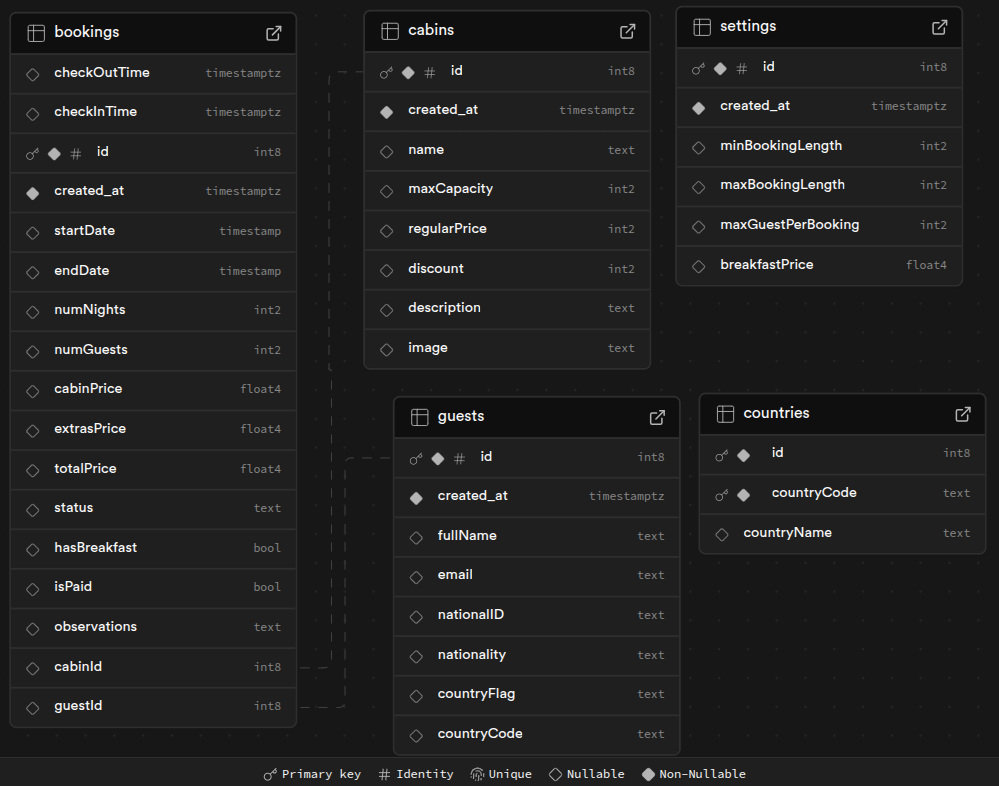

# 🏨 The wild oasis Website - Hotel Management App

## 📌 Project Overview

The wild oasis  is a hotel management website where guests can log in and book reservations. Built with **Next.js** and **Tailwind CSS**, the application provides a smooth user experience with animations and icons. Authentication is managed via **Auth.js**, while **Supabase** handles the database. This project includes both **server-side** and **client-side** components.

---

## 🛠️ Tech Stack

- **Frontend:** Next.js
- **Backend & Database:** Supabase, Auth.js, Vercel
- **UI Styling:** Tailwind CSS
- **Libraries Used:** react-day-picker, date-fns

---

## 🎯 Features

### 🔐 Authentication

- Users can **sign up** via Google authentication.
- New users can only sign up **within the application** (ensuring only hotel employees get accounts).
- Users can **update their profile** and **make reservations**.

### 🏡 Cabin Page

- View available **cabins with descriptions**.
- Make reservations by clicking on **Details & Reservation**.
- Select **dates** and **number of guests**.
- Filter cabins based on **guest capacity**.

### ℹ️ About Page

- A simple page where users can learn more about the company.

### 👤 Guest Dashboard

- Each guest can **manage their reservations**:
  - Edit **number of guests** or leave **feedback** on reservations.
  - **Delete** reservations if needed.
  - Update their profile, including **national ID** and **nationality**.

---

## 🚀 Installation & Setup

### 📥 Prerequisites

Ensure you have the following installed:

- [Node.js](https://nodejs.org/)
- [Supabase account](https://supabase.com/)
- A hosting service (e.g., Vercel) for deployment

### 🌐 Setting Up Supabase API



---

## ⚡ Steps to Run Locally

1️⃣ **Clone the repository**:

```sh
 git clone https://github.com/rajwindersxxx/the-wild-oasis-website.git
 cd the-wild-oasis-website
```

2️⃣ **Install dependencies**:

```sh
 npm install
```

3️⃣ **Set up environment variables**:

- Create a **.env.local** file in the root directory (🚨 DO NOT SHARE THIS FILE 🚨)

```sh
SUPABASE_URL=SUPABASE_URL
SUPABASE_KEY=SUPABASE_SERVER_KEY

# NextAuth Configuration
NEXTAUTH_URL=APPLICATION_URL
NEXTAUTH_SECRET=YOUR_SECRET_KEY

# Google Authentication
AUTH_GOOGLE_ID=GOOGLE_AUTH_ID
AUTH_GOOGLE_SECRET=GOOGLE_SECRET
```

4️⃣ **Run the application**:

```sh
 npm run dev
```

---

Enjoy using **Nexter - Your Hotel Management Solution**! 🚀✨

